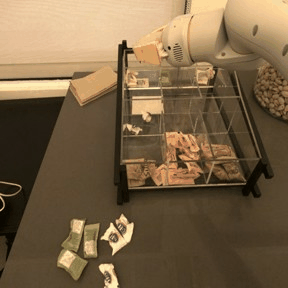
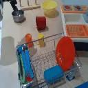
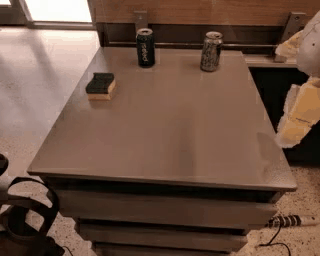
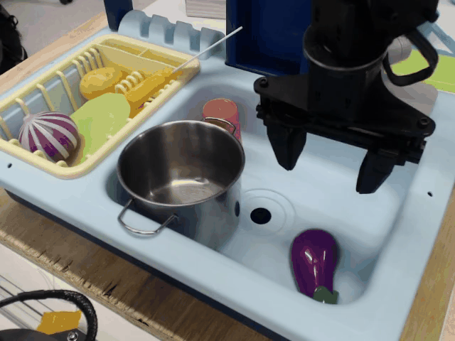

# 1. RoboVQA

## Example data

```
Task 0 (type: <task:future_prediction:freeform>): Q: what is likely to happen next? A: put the yellow packet in the organizer
Task 1 (type: <task:remaining5_planning_with_context20:freeform>): current goal is: place sugar packets in the correct sections of the clear plastic tray. last 20 steps: 1- organize the brown sugar packets in the tray 2- drop candy into organizer 3- put the sugar packet in the organizer 4- drop candy into organizer 5- put the pink packet in the organizer 6- put the pink packet in the organizer 7- drop candy into organizer 8- put the yellow packet in the organizer 9- drop candy into organizer Q: next 5 steps? A: 1- put the yellow packet in the organizer 2- put the yellow packet in the organizer 3- drop candy into organizer 4- drop candy into organizer 5- done
Task 2 (type: <task:planning:freeform>): current goal is: place sugar packets in the correct sections of the clear plastic tray Q: immediate next step? A: put the yellow packet in the organizer
Task 3 (type: <task:success:discrete:False>): put the yellow packet in the organizer Q: satisfied? A: no
Task 4 (type: <task:affordance:discriminative:discrete:True>): put the yellow packet in the organizer Q: possible right now? A: yes
Task 5 (type: <task:affordance:generative:positive:freeform>): Q: what action is possible right now? A: put the yellow packet in the organizer
Task 6 (type: <task:immediate_planning_with_context20:freeform>): current goal is: place sugar packets in the correct sections of the clear plastic tray. last 20 steps: 1- organize the brown sugar packets in the tray 2- drop candy into organizer 3- put the sugar packet in the organizer 4- drop candy into organizer 5- put the pink packet in the organizer 6- put the pink packet in the organizer 7- drop candy into organizer 8- put the yellow packet in the organizer 9- drop candy into organizer Q: immediate next step? A: put the yellow packet in the organizer
```

## Remarks
- Con. Long horizon tasks are basically pick and place and may not include much difficulty of planning? This may include too many repetitive "long-horizon" actions. For instance, when the task is 'putting all oranges into the bowl', there will be repetitive 'pick up an orange'.
- Con. Only have (Video, Question, Answer) tuples in the dataset. All video only have 16 frames. The full task trajectories are not given.
- ?. The hindsight subtask description is very high-level. For instance, 'put the yellow packet in the organizer' essentially include 'move the arm to the yellow packet' + 'grasp the yellow packet' + 'move the arm above the organizer' + 'drop the yellow packet so that the yellow packet is inside the organizer'.

# 2. Mobile Aloha

## Remarks
- Con. Sometime the high camera can't capture the full scene. For instance, one arm put the oil bottle to somewhere that the high camera doesn't cover. This may bring some challenges to automatic hindsight labelling.
- Pro. No suboptimal trajectories and all are somehow well-designed long horizon tasks that do need planning.

# 3. CMU play fusion

## Example data


```
"pick orange cup and place on wooden hanger"
```

## Remarks
- Con. The resolution is too small: 100x100.
- Con. There is only one camera and can't conver the whole scene sometime.
- Con. The scene is just a toy kitchen.
- Con. Short horizon.
- Con. Unlike BridgeV2, doesn't have cartesian eef position.
- Pro. Don't have suboptimal trajectories.

# 4. Stanford hydra

## Example data


```
'make a cup of coffee with the keurig machine'
```

## Remarks
- Con. Sometimes the robot uses waypoint control. The robot may pause and think periodically. This may disturb key frame detection.
- Con. The wrist camera is too 'local'. Sometimes it can't catch enough local information.
- Pro. Long-horizon tasks and need planning.
- Pro. Clear third-person camera.

# 5. UTaustin mutex

## Example data


```
Gently grip the air fryer handle with your gripper and kindly pull it open by sliding your gripper away from the base.
Gradually bring your gripper in line with the blue bowl and gently capture it, without tightening your grip too much.
Securely place the blue bowl inside the opened air fryer with a steady position.
Liberate your robot's gripper, and withdraw your gripper from the proximity of the air fryer.
```

## Remarks
- Pro. Contain human speech instruction, which can be used as subtask.
- Con. Still don't provide video segmentation.
- Con. Sometimes the object description of the task description is wrong.
- Con. No global task description.
- Con. Too small image resolution 128x128.
- Con. Human's instructions are sometimes too tedious. Can be more concise.
- Tip: use open-x embodiment to download the dataset. Don't use the link provided by the authors.

# 6. fmb

## Example data


```
Insert the green object.
```

## Remarks
- Pro. Include eef pose.
- Pro. Clear visual scene and comprehensive camera settings.
- Pro. May be a good data source to teach the image encoder about grasping affordance and pay attention to reletive part of the visual observation given the global task description.
- Con. Duplicative environment settings. If the dataset weight too high in the training data mix, overfitting may happen.

# RT1

## Example data


```
'move green can near sponge'
```

## Remarks
- Pro. Clear visual scene. Almost no visual partial observation.
- Con. Too slow control frequency (3Hz).
- Con. Short horizon.
- ?. Include lots of relative position of objects. This can teach the model about spatial concept. But this may also introduce overfitting to behaviour custome -- for instance, 'next' can mean everywhere surrounding the object but in demonstrations the majority of 'next' means 'right'.

# DROID

## Example data


```
{
    "language_instruction": "Hang the white cloth on the black stand",
    "language_instruction_2": "Hang the cloth on the black stand",
}
```

## Remarks
- Pro. Very diverse scenes and tasks.
- Pro. Multiple cameras and can typically capture what is happening.
- Pro. Include cartesian eef position which is good for key frame detection.
- Con. Short horizon.
- Con. Include very suboptimal datapoints.

# Bridge

## Example data

```
'put eggplant into pot or pan'
```

## Remarks
- Pro. Clear visual scene.
- Con. Short horizon.
- Con. Toy kitchen and 13 scenes. Maybe OOD wrt the real world tasks.


# RoboMIND